# Mariposa Sagrada: Historieta animada-interactiva enfocada a la mariposa Monarca

Este proyecto es una historieta animada-interactiva, muestra la ruta y los desafíos que enfrenta la Mariposa Monarca para llegar a su destino. Desarrollada en Python con ayuda de herramientas como OpenToonz (animación), Paint Tool SAI (diseño y dibujo) y Ren'Py (motor del juego).

El propósito de este proyecto para el Trabajo Terminal, es que los usuarios puedan aprender sobre la ruta que sigue la mariposa Monarca y los obstáculos a los que se enfrenta. Con el fin de divulgar, la importancia de la conservación y protección del hábitat de esta especie. Para el desarrollo de este proyecto se hizo uso de la metodología en Espiral, donde se integraron tres ciclos los cuales son: Prototipo 1, Alpha y Beta. **Aquí sólo se encuentra el Prototipo 1**, pero a continuación se muestran capturas de pantalla de la aplicación finalizada:

## Capturas de pantalla:
### Pantalla y menú principal:
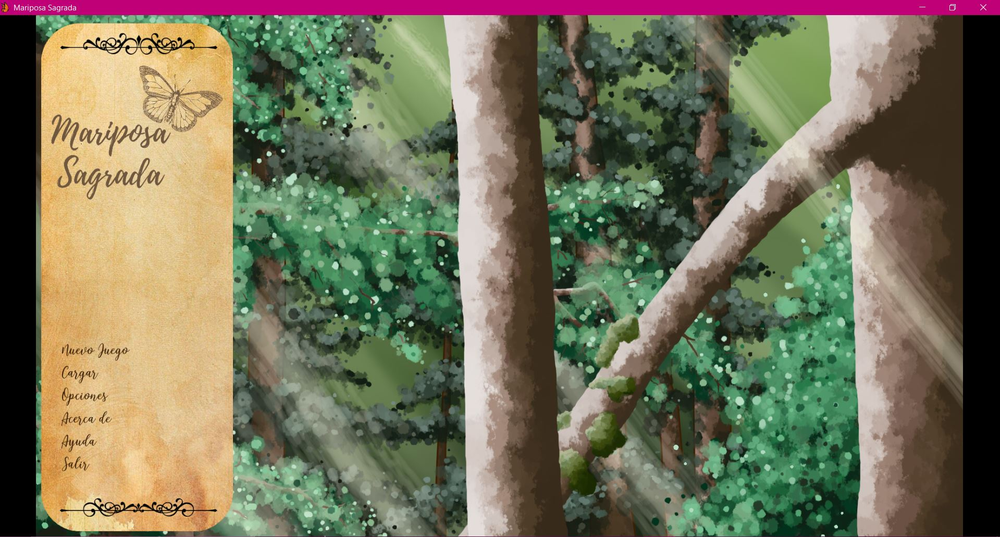

### Registro del género de la mariposa:
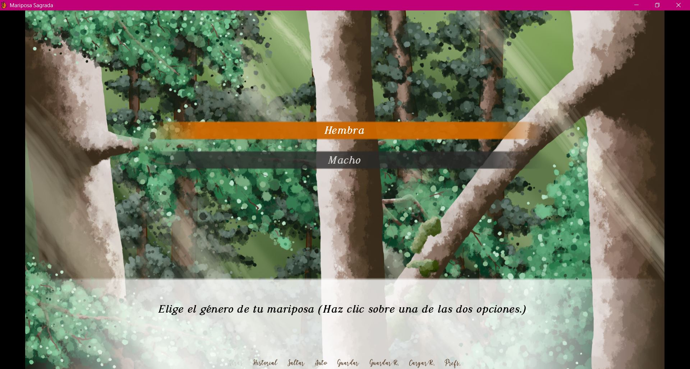

### Mensajes informativos:
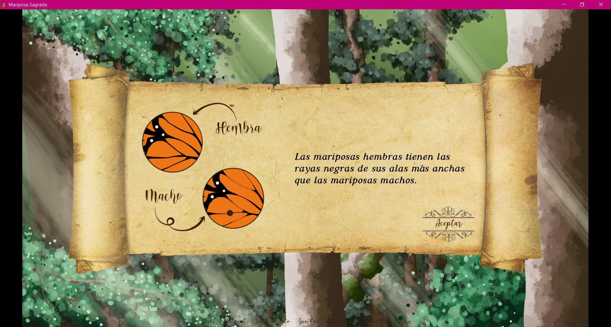

### Registro de nombre de usuario:
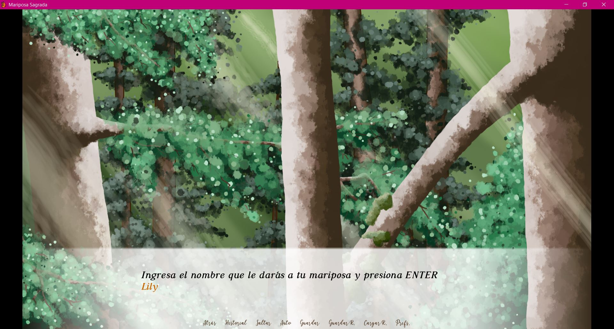

### Instrucciones de jugabilidad:
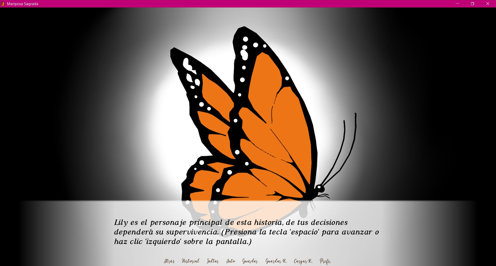

### Capítulo 1 de la historieta *"El Algodoncillo"*:
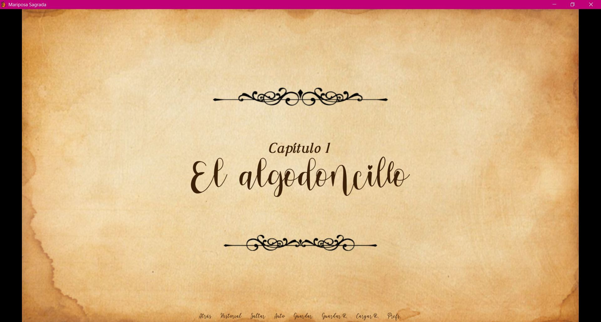

### Ítems y mensajes de notificación:
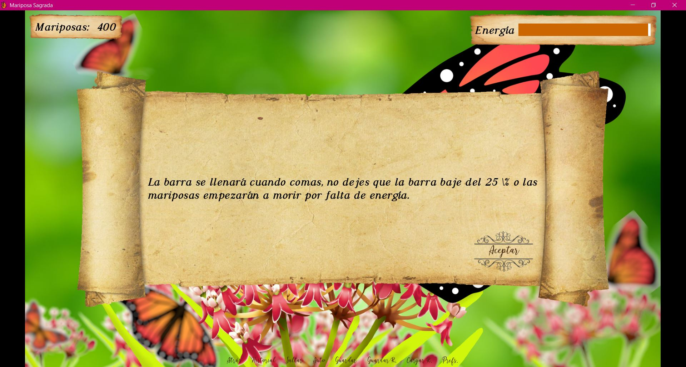

### Final de capítulo:
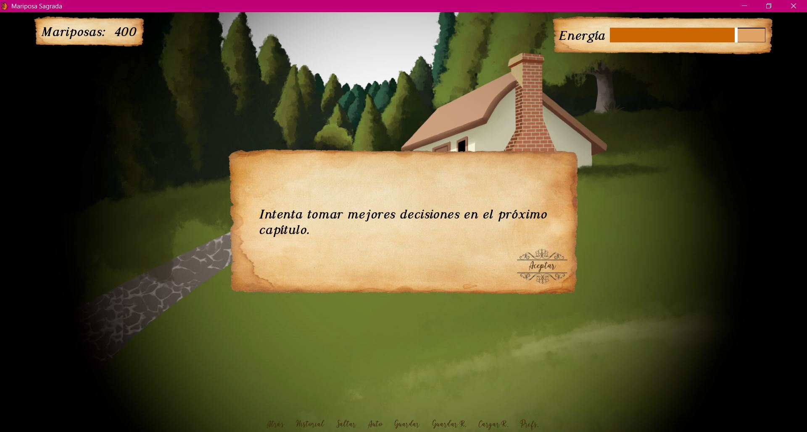

### Final bueno:
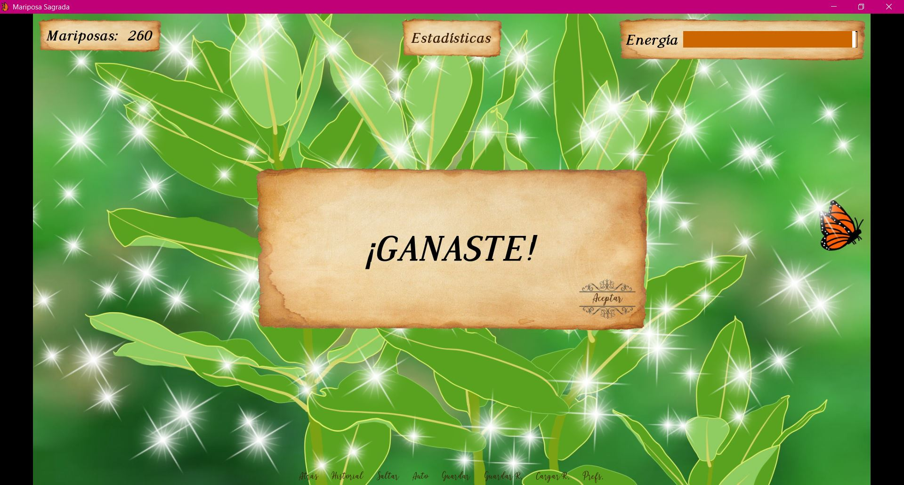

### Estadísticas:
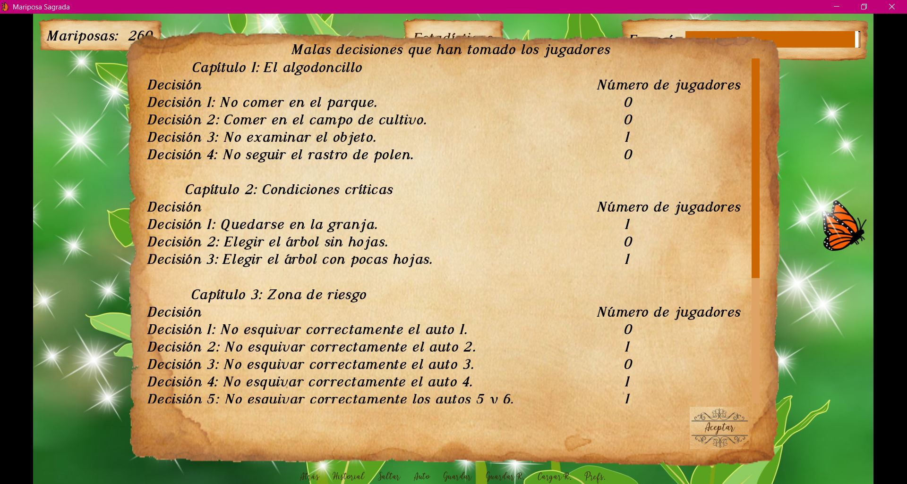
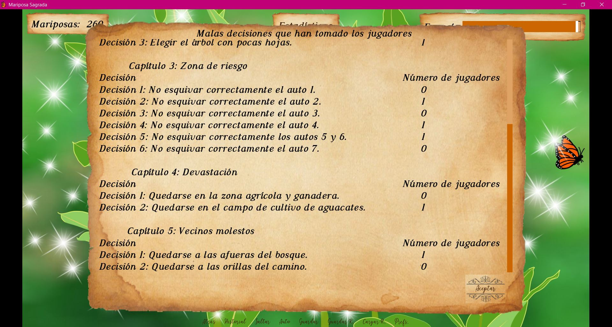

## Tecnologías
- Python
- Ren'Py
- OpenToonz
- Paint Tool SAI

## Ver artículo
Lee más sobre nuestro trabajo en la Gaceta Politécnica...
[Mariposa Sagrada](https://www.ipn.mx/assets/files/ccs/docs/gaceta-seleccion/2023/06/g-162-m.pdf)
